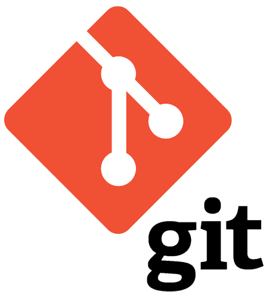
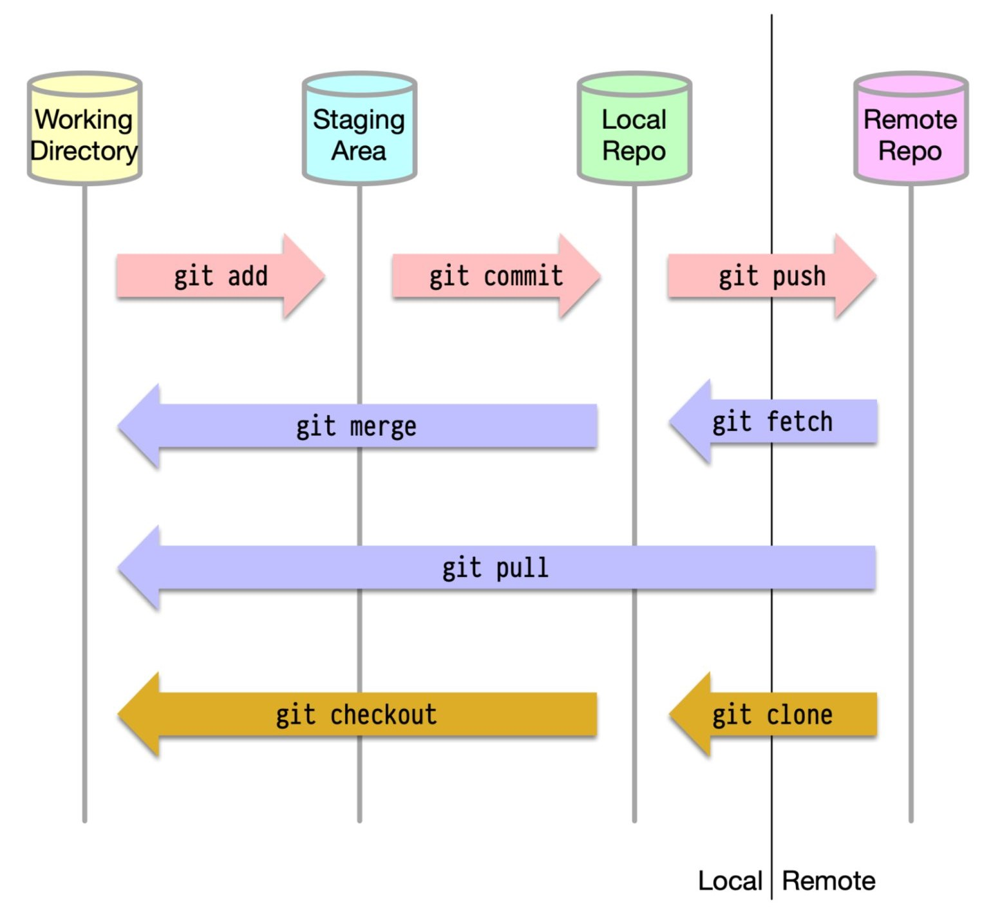

# 🚀Git & GitHub Basic Cheat Sheet🚀


Welcome to the **Git & GitHub Basics Cheat Sheet!** This repository contains a collection of essential Git and GitHub commands to help you manage your code effectively.

# Why Learn Git Before GitHub?


**Git is the tool** that helps you track changes in your code and manage different versions. **GitHub is a website** that lets you share your Git projects with others. **By learning Git first, you understand how to control your code locally.** This makes it easier to use GitHub’s features for collaboration and sharing.

# What is Git?



Git is a version control system that helps you manage and keep track of changes to your code. Here’s a breakdown:

+ **Track Changes :** Git keeps a record of every change you make to your code, so you can look back and see what you did at any point in time.

+ **Collaboration :** If you're working with other people, Git makes it easy to collaborate. Everyone can work on their own copy of the code, and then merge their changes together.

+ **Backup :** Git acts like a backup system. If you mess something up, you can easily revert to an earlier version of your code.

+ **Branches :** You can create "branches" in your project to work on different features or fixes simultaneously. This way, you don't mess up your main codebase while experimenting with new ideas.

# What is GitHub?


GitHub is an online platform for storing and sharing code. It allows you to work on projects with others by tracking changes and managing contributions. Think of it as a central place where developers can collaborate and maintain their code together.

# Git and GitHub: Simplified Explanation
Git is a version control system that helps you manage changes in your code locally, while GitHub is a web-based platform that allows you to store, share, and collaborate on your Git repositories with others remotely. 


# Quick Terminology Check

**Repository**
    
+ A repository is a place where you have all your codes or kind of folder on the server.
+ It is a kind of folder related to one product.
+ Changes are personal to that particular repository.

**Server**

+ It stores all repository
+ It contains metadata also

**Working directory**

+ Where you see files physically and do the modification.
+ At a time, you can work on a particular branch.

**Commit**

+ Store changes in the repository. You will get one Commit-Id.
+ It is 40 Alpha-Numeric characters.
+ It uses the SHA1 checksum concept.
+ Even if you change one dot, Commit-Id will change.
+ Commit is also named the SHA-1 hash.

**Commit Id/Version-Id/Version**

+ Reference to identify each change.
+ To identify who changed the file.


**Tags**

+ Tags assign a meaningful name with a specific version in the repository. Once a tag is created for a particular save, even if you create a new commit, it will not be updated.

**Snapshots**

+ Represents some date of a particular time.
+ It is always incremental i.e- It stores the change (append date) only. Not the entire copy.

**Push**

+ Push operations copy changes from a local repository server to a remote or central repository. This is used to store the changes permanently in the git repository.

**Pull**

+ Pull operation copies the changes from a remote repository to a local machine. The pull operation is used for synchronization between the repository.

# Git Architecture 


# Contents

- <a href="#install-git" style="text-decoration:none">Install Git</a>
- <a href="#git-setup" style="text-decoration:none">Git Setup</a>
- <a href="#git-commands" style="text-decoration:none">Git Commands</a>
- <a href="#branching" style="text-decoration:none">Branching</a>
- <a href="#commit-history" style="text-decoration:none">Commit History</a>
- <a href="#resolve-conflicts" style="text-decoration:none">Resolve Conflicts</a>
- <a href="#github-commands" style="text-decoration:none">GitHub Commands</a>


## Install Git

Ensure Git is installed on your computer. You can download it from [Git's official website](https://git-scm.com/downloads).

## Git Setup
**Show Current Configuration**

```bash
  $ git config --list

```
**Displays the Git configuration settings specific to the current repository**

```bash
  $ git config --local --list
```

**Displays the Git configuration settings globally for the user**

```bash
  $ git config --global --list
```

**Displays the Git configuration settings at the system level**

```bash
  $ git config --system --list
```

**Set global user name**

```bash
  $ git config --global user.name "[firstname lastname]"
```
**Set global email id**

```bash
  $ git config --global user.email "[valid-email]"
```
## Git Commands

**Initialize an empty repository**

```bash
  $ git init
  ```
**Clone an existing repository**

  There are two ways:

  Via SSH :

  ```bash
    $ git clone ssh://user@domain.com/repo.git
  ```
  Via HTTP :

```bash
  $ git clone http://domain.com/user/repo.git
```

**Add file**

```bash
  $ git add <filename>
```
**Add all current directory files to git**

```bash
  $ git add .
```
**Commit all the staged files to git**

```bash
  $ git commit -m "<Your_commit_message>"
```
**Show the status of git repository**

```bash
  $ git status
```
**Show remote origin URL**

```bash
  $ git remote -v
```
**Add remote origin URL**

```bash
  $ git remote add origin <your_remote_git_url>
```
**Remove origin URL**

```bash
  $ git remote remove origin
```
**Fetch all the remote branches**

```bash
  $ git fetch
```
**Push your local changes to the remote branch**

```bash
  $ git push origin <branch_name>
```
**Pull your remote changes to the local branch**

```bash
  $ git pull origin <branch_name>
```
## Branching

**Create a new branch**

```bash
  $ git branch <branch_name>
```

**Switches to the specified branch**

```bash
  $ git checkout <branch_name>
```
**Create and Switch to new branch**

```bash
  $ git checkout -b [new branch_name][from branch]
```
**Pushes the specified branch to the remote repository**

```bash
  $ git push origin <branch_name>
```
**Fetches and merges changes from the remote branch into the current branch**
```bash
  $ git pull origin <branch-name>
```
**Delete the branch**

```bash
  $ git branch -d <branch_name>
```
**Merges the specified branch into the current branch**

```bash
  $ git branch <branch_name>
```
## Commit History

**Shows detailed commit history**

```bash
  $ git log
```
**Shows commit history in a single line format**

```bash
  $ git log --oneline
```
**Shows all commits by a specific user**

```bash
  $ git log --author="username"
```
**Shows changes for a specific file**

```bash
  $ git log -p <file>
```
**Shows commits unique to a remote branch**

```bash
  $ git log --oneline <origin/master>..<remote/master> --left-right
```
**Shows who changed each line of a file**

```bash
  $ git blame <file>
```
**Shows the reference log**

```bash
  $ git reflog show
```
**Deletes entries from the reference log**

```bash
  $ git reflog delete
```
## Resolve Conflicts

**Lists commits causing conflicts**

```bash
  $ git log --merge
```
**Shows differences between states of repositories or files**

```bash
  $ git diff
```
**Undoes changes to a file or switches branches**

```bash
  $ git checkout <file/branch>
```
**Resets changes to the working directory and staging area**

```bash
  $ git reset --mixed
```
**Exits merge and reverts to pre-merge state**

```bash
  $ git merge --abort
```
**Reset conflicted files to original state**

```bash
  $ git reset
```